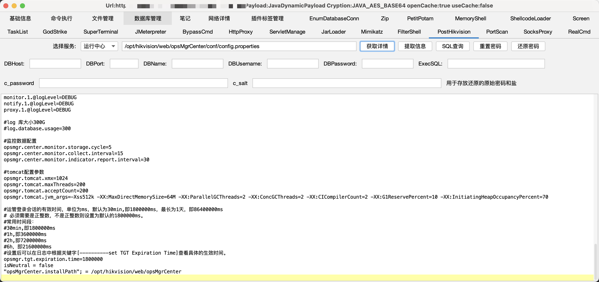
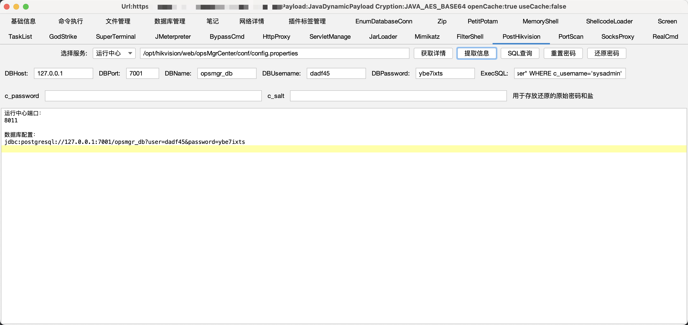
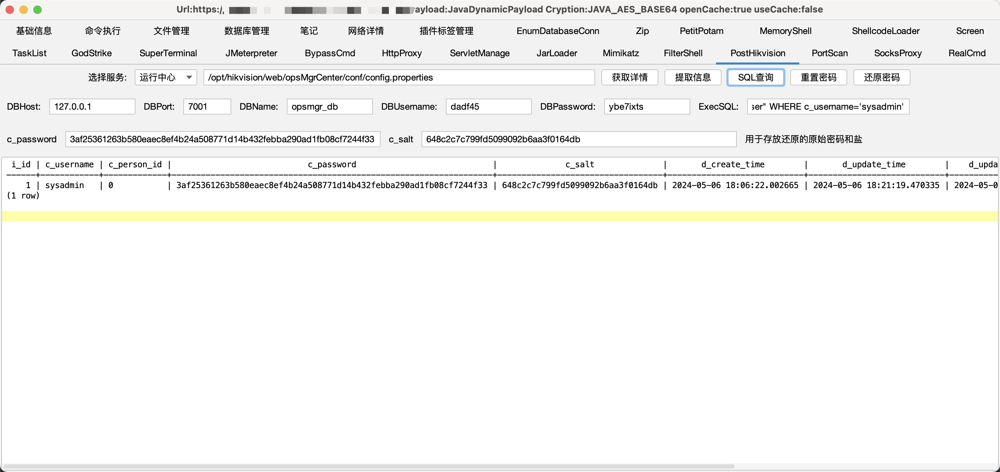
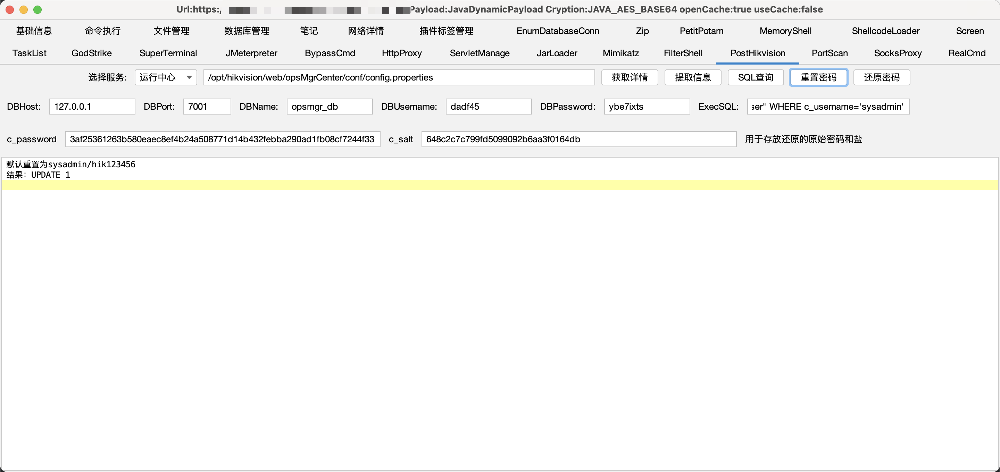
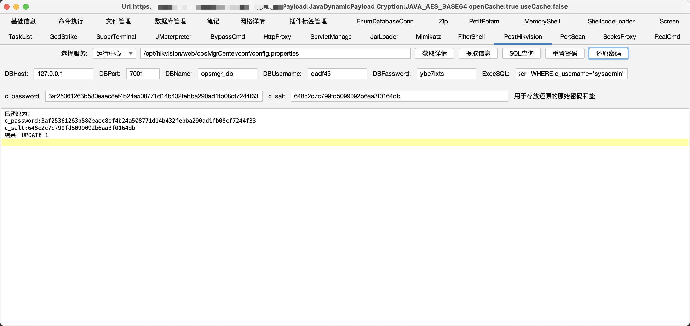

# PostHikvision

哥斯拉Hikvision综合安防后渗透插件，运行中心/web前台/MinIO 配置提取（解密）重置密码,还原密码。

## 功能简介

当你在 Hikvision综合安防拥有一个哥斯拉webshell之后，你可以使用 PostHikvision 后渗透插件：

1. **获取详情**
   - 从指定路径（自动获取）获取配置文件的详细信息。
2. **提取信息**
   - 从配置文件中自动提取敏感信息，并尝试解密。
   - 部分密文解密存在bug，需用海康专项解密工具
3. **SQL 查询**
   - 哥斯拉低版本execSql存在bug，采用execCommand实现更通用
   - 默认查询并提取密码和盐值，懒人化。
4. **重置密码**
   - 修改指定用户的密码，支持重置为默认密码。
5. **还原密码**
   - 根据提供的原始密码和盐值，恢复用户的密码。

## 使用说明

下载哥斯拉插件Jar包

然后打开哥斯拉 点击配置->点击插件配置->点击添加并选择你下载的Jar包

## 部分功能演示

### 获取详情

### 提取信息

### sql查询

### 重置密码

### 还原密码

## 参考文章

https://github.com/wafinfo/DecryptTools

https://beichendream.github.io/godzillaApi/

